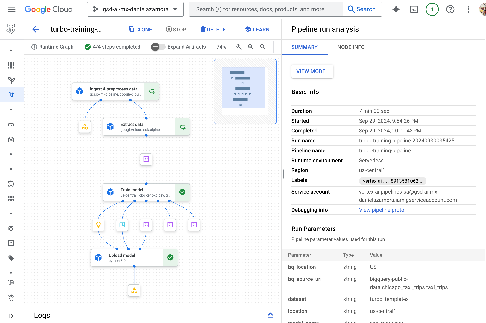
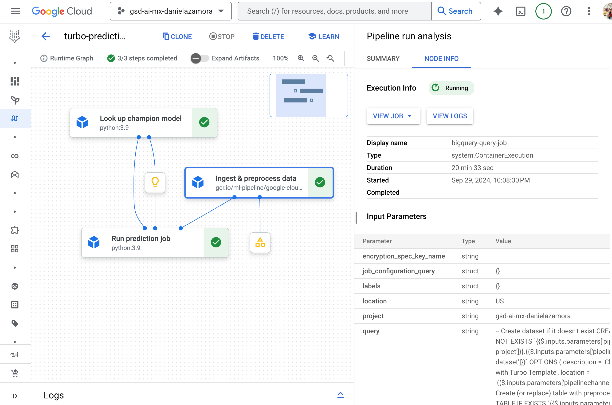

## Running a pipeline 🚀

This file contains the instructions to run pipelines in the repository. The example shown in the instructions runs the `training` and `prediction` pipelines.

Nevertheless, the instructions are the same to run any other pipeline in the repository 👀. To run a different pipeline, change the name to your pipeline's `.py` file in the `make run pipeline=...` step.

   > **INFO ℹ️:** Use `make help` to for additional information on the inputs of the make targets.

### Instructions

   > **IMPORTANT 1️⃣🚨:** Validate you've followed the environment setup in the repository's `README` (modifying your `env.sh` file is key for the following steps).

In the root directory:

1. Install the components, pipeline, and dependencies locally (uses `poetry` environments):
    ```bash
    make install 
    ```
1. Authenticate with your credentials:
    ```bash
    make auth 
    ```
    `+` follow instructions.

1. Run the following command to both build and push your **Custom Python Package** to Artifact Registry:
    > **INFO ℹ️:** The Custom Python Package in this repo (under folder `package`) can contain functions used in some components.
    ```bash
    make publish-package add_user=true increment=false
    ```
    Validate which version of the package you've just deployed to AR (e.g. `package 2.0.0+danielazamora` or `package 2.0.0` ). For this, you can:

    1. Observe the `package_name` in the terminal "Publish Custom Package 'package_name' to Artifact Registry ..."  
    1. Look in the file `pyproject.toml` under `package`.    
    1. Directly open the Artifact Registry repository used for python in your environment (found in the variavle `AR_PYTHON` in the `env.sh` file) and looking for the most recently uploaded version of the package `package`.

1. Build dependent Docker containers (training and prediction):
    ```bash
    make build
    ```

1. You're good to go 🚀, run the training pipeline with the following command:
    ```bash
    make run pipeline=training wait=true
    ```
    This command:
    1. Compiles the pipeline .
    1. Builds dependent Docker containers (done separately in the previous step).
    1. Runs the pipeline in Vertex AI.  
    
    ----------------------
    `true`/`false` flags:
    - `build` - to build a Docker Image with the code of the "enrichment batch" component (ONLY RUN `build=true` the first time you run a pipeline in this repository or when the files under the `model` folder have changed).
    - `compile` - to compile the pipeline to YAML from the source code (the default is `true`).
    - `cache` - to cache the components where no input has changed (the default is `true`).
    - `wait` - to wait for the pipeline job to finish in the terminal (the default is `false`).
    ----------------------
    
    Now, you can see your training pipeline run 🎉🎉:

    

1. For prediction, run:
    ```bash
    make run pipeline=prediction
    ```
    And you're done! You've just ran training and prediciton Vertex AI pipelines.
    
    


